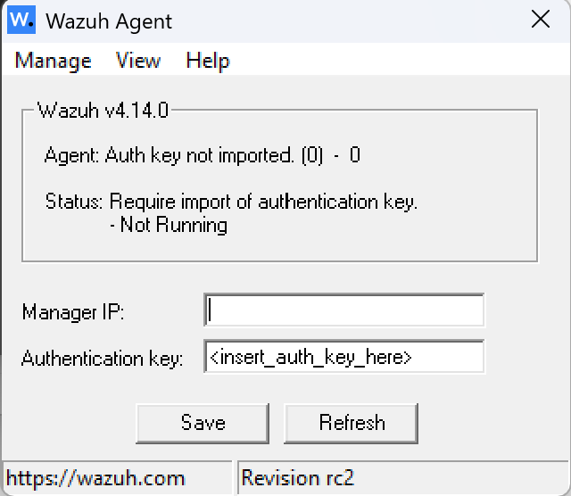
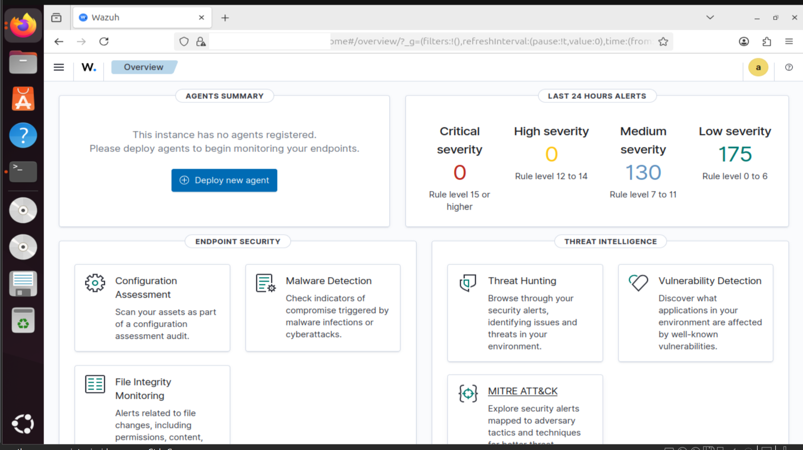
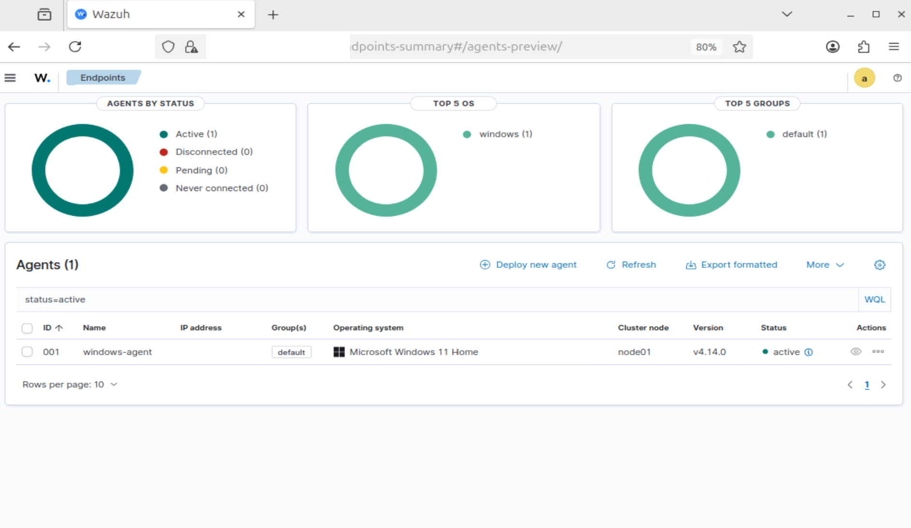
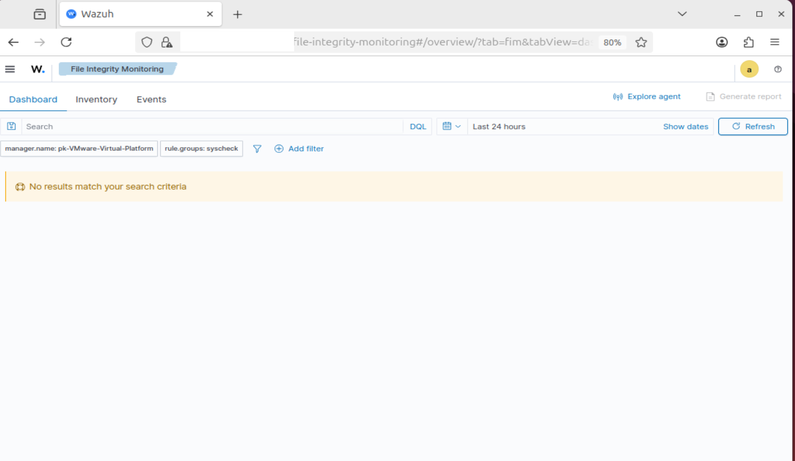
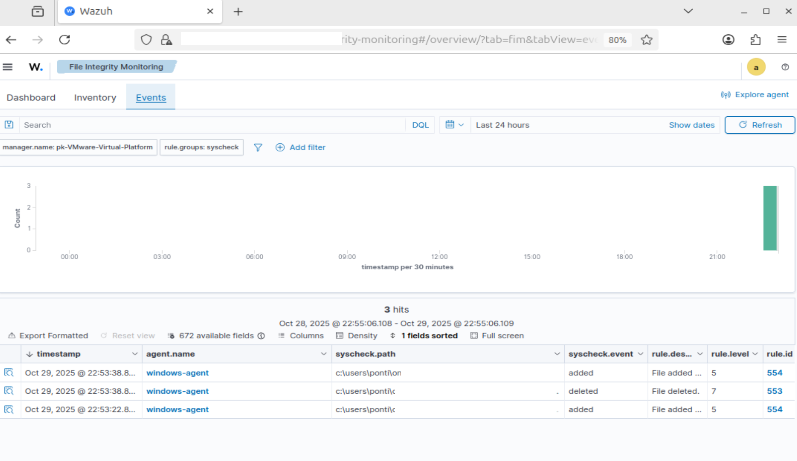

# Cybersecurity SIEM Lab with Wazuh


## Overview
This lab demonstrates how to set up and configure Wazuh, an open-source Security Information and Event Management (SIEM) platform. Wazuh provides real-time monitoring, intrusion detection, log analysis, and incident response capabilities for Linux and Windows environments. In this setup, Windows acts as the Wazuh Agent, Ubuntu as the Manager, and VMware/VirtualBox hosts the virtual environment.


## Lab Components
| Component | Role | Description |
|------------|------|-------------|
| **Ubuntu (VM)** | Wazuh Manager | Central management and analysis dashboard |
| **Windows (Host)** | Wazuh Agent | Collects and sends system logs to the manager |
| **VirtualBox/VMware** | Virtualization Platform | Runs Ubuntu in an isolated environment |
| **Wazuh** | SIEM Platform | Detects threats, analyzes logs, and visualizes data |


## 🗺️ System Diagram

                            ┌──────────────────────────────────┐
                            │          Ubuntu VM               │
                            │   Wazuh Manager & Dashboard      │
                            │          IP: 192.168.1.100       │
                            └───────────────┬──────────────────┘
                                            │
                                  Host-Only / NAT Network
                                            │
                            ┌───────────────┴──────────────────┐
                            │           Windows Host           │
                            │        Wazuh Agent / Client      │
                            │          IP: 192.168.1.110       │
                            └──────────────────────────────────┘


                                        🔁 Data Flow

                     Windows Agent  ───▶  Sends logs & alerts  ───▶  Wazuh Manager


                     Wazuh Manager  ───▶  Analyzes & displays results  ───▶  Dashboard

---
## ⚙️ Setup Steps
### Install Ubuntu on VirtualBox / VMware
1. Download Virtual Machine Software
- [VirtualBox](https://www.virtualbox.org/wiki/Downloads)  
- [VMware Workstation / Fusion](https://www.vmware.com/products/desktop-hypervisor/workstation-and-fusion)

2. Download Ubuntu ISO
- [Ubuntu Official Download](https://ubuntu.com/download)

3. Create a New Virtual Machine
**Settings:**
- **Name:** `Ubuntu-Wazuh-Manager`  
- **Type:** Linux  
- **Version:** Ubuntu (64-bit)  
- **Memory:** 4 GB  
- **Storage:** 20 GB+  

Mount the Ubuntu ISO and complete the installation.

**Video Tutorial:**  
- [Download Ubuntu on VirtualBox](https://www.youtube.com/watch?v=IOSEdXVmmpM)  
- [Download Ubuntu on VMware](https://www.youtube.com/watch?v=CNAmlDEzqKo)

### Save the IP addresses
Before proceeding, note down the IP addresses of both your **Windows** and **Ubuntu** machines.
We will need them later for configuration and connection setup.

To check the IP address on your Ubuntu system, run:
```bash
ip a
# or 
hostname -I
```

On Windows:
```bash
Get-NetIPAddress
# or
ifconfig
```

### Install Wazuh Manager on Ubuntu (VM)
Update your system:
```bash
sudo apt update && sudo apt upgrade -y
```
Install curl, Wazuh Manager ,and Dashboard using the official quick setup:
```bash
sudo su
curl -sO https://packages.wazuh.com/4.x/wazuh-install.sh                
bash ./wazuh-install.sh -a
```
Note: Installation takes around 20-30min

After installation, open the Wazuh Dashboard in your browser:
```
https://<Ubuntu_IP>:443
```
Log in with the credentials displayed during installation (default user: admin).

Video Tutorial (Youtube): 
[Install Wazuh On Ubuntu](https://www.youtube.com/watch?v=JTGMWH2w2p4)

### Install Wazuh Agent on Windows (Host)
Download and install the Wazuh Agent for Windows:
- [Wazuh Agent for Windows (Official Download)](https://documentation.wazuh.com/current/installation-guide/wazuh-agent/wazuh-agent-package-windows.html)

**Steps:**
1. Run the installer.  
2. When prompted, configure:
   ](images/wazuh-agent-interface.png)
   - **Manager IP:** your Ubuntu VM’s IP (e.g., `192.168.1.100`)  
   - **Authentication Key:** Generated from /var/ossec/bin/manage_agents on ubuntu (e.g., `kdhgdjbbhsbnshnxb`)
3. Complete the installation and start the Wazuh Agent service.  
4. Verify the connection from your Ubuntu Wazuh Dashboard under:  
   ```
   Management → Agents
   ```

---
## Testing the Setup
1. On Ubuntu, open the Wazuh Dashboard
   ```
   https://<Ubuntu_IP>:443
   ```
   Navigate to:
   ```
   Management → Agents
   ```
   Verify that your Windows agent appears as active.

    ](images/dashboard-before-linking-agent.png)
    

    ](images/dashboard-after-linking-agent.png)

2. Generate a test alert from Windows
   Open PowerShell and run:
   ```bash
   type C:\Windows\System32\drivers\etc\hosts
   ```
   Check the Wazuh Dashboard for a new alert under Security Events.

3. File monitoring alert
   - **Create a test folder:**  
    On windows, create a folder and copy the path (e.g., C:\wazuh-test).
   - **Open the Wazuh Agent configuration file:**  
    Run **Notepad as Administrator**, then open the following file:  
    ```
    "C:\Program Files (x86)\ossec-agent\ossec.conf"
    ```
   - **Add the directory to monitor:**  
    Inside the `<ossec_config>` section, add the following line (replace the path with your test folder):
    ```xml
    <directories realtime="yes">C:\wazuh-test</directories>
    ```
   - Save and restart the Wazuh Agent service to apply the changes.
   - test the setup by adding or modifying a file inside the C:\wazuh-test folder. Wazuh should generate a   real-time alert in the dashboard under **Security Events → File Integrity Monitoring**.

   ](images/file-monitoring-without-alert.png)


   ](images/file-monitoring-with-alert.png)


## Troubleshoot
#### Network Connection
If you’re having trouble connecting to the internet or resolving domains inside Ubuntu, try the following steps:
1. **Check your network type:**  
   Make sure the virtual machine is connected to a **NAT network** in VirtualBox or VMware.
2. **Reconnect the network:**  
   Disconnect and then reconnect your VM’s network adapter.
3. **Restart the machine:**  
   A simple reboot can often resolve temporary connection issues.
   ```bash
   sudo reboot
   ```
4. **Verify connectivity**
   After restarting, run the following commands to confirm that your internet connection is working properly.
   ```bash
   ping google.com
   sudo apt update
   ```

#### Missing Packages
If you encounter missing or broken package errors while installing Ubuntu, run:
```bash
sudo apt update
sudo apt install -f --fix-missing
```
or 

Restart the resolver
```bash
sudo systemctl restart systemd-resolved
```
Recreate /etc/resolv.conf if it's broken
```bash
ls -l /etc/resolv.conf
# If it's NOT a symlink to /run/systemd/resolve/stub-resolv.conf, fix it:
sudo rm -f /etc/resolv.conf
sudo ln -s /run/systemd/resolve/stub-resolv.conf /etc/resolv.conf
sudo systemctl restart systemd-resolved
```

  
## 🧾 Resources
- [Wazuh Official Documentation](https://documentation.wazuh.com)
- [Wazuh GitHub Repository](https://github.com/wazuh/wazuh)
- [Install Ubuntu on VirtualBox (Video)](https://www.youtube.com/watch?v=IOSEdXVmmpM)
- [VirtualBox Download Page](https://www.virtualbox.org/wiki/Downloads)

---
**Last Updated:** October 2025