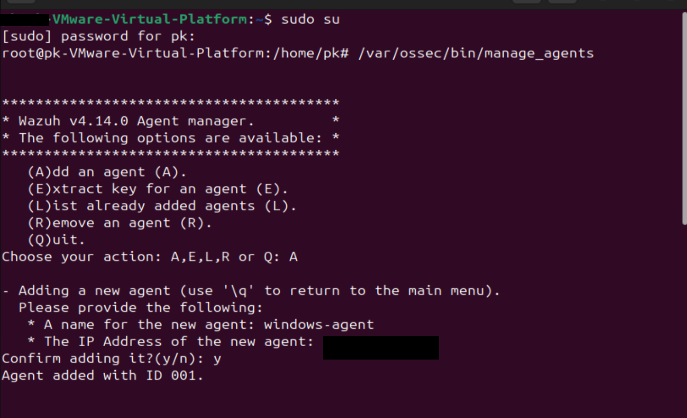
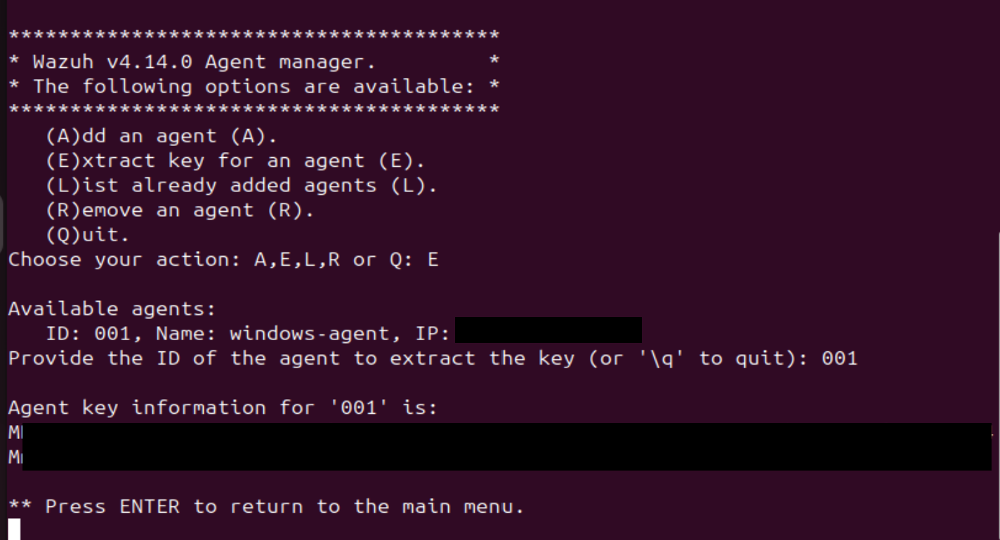

# Cybersecurity SIEM Lab with Wazuh🔒

## 📑 Table of Contents
- [Overview](#overview)
- [Lab Components](#lab-components)
- [System Diagram](#%EF%B8%8F-system-diagram)
- [Setup Steps](#%EF%B8%8F-setup-steps)
- [Testing the Setup](#6-testing-the-setup)
- [Troubleshoot](#%EF%B8%8Ftroubleshoot)
- [Resources](#resources)
---
## 🌐Overview
This lab demonstrates how to set up and configure Wazuh, an open-source Security Information and Event Management (SIEM) platform. Wazuh provides real-time monitoring, intrusion detection, log analysis, and incident response capabilities for Linux and Windows environments. In this setup, Windows acts as the Wazuh Agent, Ubuntu as the Manager, and VMware/VirtualBox hosts the virtual environment.


## 💻Lab Components
| Component |Role | Description |
|------------|------|-------------|
| **Ubuntu (VM)** | Wazuh Manager | Central management and analysis dashboard |
| **Windows (Host)** | Wazuh Agent | Collects and sends system logs to the manager |
| **VirtualBox/VMware** | Virtualization Platform | Runs Ubuntu in an isolated environment |
| **Wazuh** | SIEM Platform | Detects threats, analyzes logs, and visualizes data |


## 🗺️ System Diagram

                            ┌──────────────────────────────────┐
                            │          Ubuntu VM               │
                            │   Wazuh Manager & Dashboard      │
                            │          IP: 192.168.1.100       │
                            └───────────────┬──────────────────┘
                                            │
                                  Host-Only / NAT Network
                                            │
                            ┌───────────────┴──────────────────┐
                            │           Windows Host           │
                            │        Wazuh Agent / Client      │
                            │          IP: 192.168.1.110       │
                            └──────────────────────────────────┘


                                        🔁 Data Flow

                     Windows Agent  ───▶  Sends logs & alerts  ───▶  Wazuh Manager


                     Wazuh Manager  ───▶  Analyzes & displays results  ───▶  Dashboard

---
## ⚙️ Setup Steps
### 1. Install Ubuntu on VirtualBox / VMware
- Download Virtual Machine Software<br />
[VirtualBox](https://www.virtualbox.org/wiki/Downloads) <br /> 
[VMware Workstation / Fusion](https://www.vmware.com/products/desktop-hypervisor/workstation-and-fusion)

- Download Ubuntu ISO<br />
[Ubuntu Official Download](https://ubuntu.com/download)

- Create a New Virtual Machine
    **Settings:**
    - **Name:** `Ubuntu-Wazuh-Manager`  
    - **Type:** Linux  
    - **Version:** Ubuntu (64-bit)  
    - **Memory:** 4 GB  
    - **Storage:** 20 GB+

- Mount the Ubuntu ISO and complete the installation.

  **Video Tutorial (Youtube):** <br/>  
  [Download Ubuntu on VirtualBox](https://www.youtube.com/watch?v=IOSEdXVmmpM) <br/>  
  [Download Ubuntu on VMware](https://www.youtube.com/watch?v=CNAmlDEzqKo)

### 2. Save the IP addresses
Before proceeding, note down the IP addresses of both your **Windows** and **Ubuntu** machines.
We will need them later for configuration and connection setup.
- To check the IP address on your Ubuntu system, run:
    ```bash
    ip a
    #or 
    hostname -I
    ```

- On Windows:
    ```bash
    Get-NetIPAddress
    #or
    ifconfig
    ```

### 3. Install Wazuh Manager on Ubuntu (VM)
Update your system:
```bash
sudo apt update && sudo apt upgrade -y
```
Install curl, Wazuh Manager, and Dashboard using the official quick setup:
```bash
sudo su
curl -sO https://packages.wazuh.com/4.x/wazuh-install.sh                
bash ./wazuh-install.sh -a
```
**Note:** Installation takes around 20-30min

After installation, open the Wazuh Dashboard in your browser:
```
https://<Ubuntu_IP>:443
```
Log in with the credentials displayed during installation (default user: admin).


**Video Tutorial (Youtube):**<br/>
[Install Wazuh On Ubuntu](https://www.youtube.com/watch?v=JTGMWH2w2p4)

### 4. Add Windows Agent to Wazuh Manager & Extract Authentication Key
Once Wazuh Manager is installed on your Ubuntu VM, follow these steps to register your Windows machine as an agent and generate the authentication key.

On your Ubuntu VM, open a terminal and run:
```bash
sudo su
/var/ossec/bin/manage_agents
```
This will launch the interactive Wazuh Agent Manager tool. You will be presented with a menu. Select:
```
(A)dd an agent
```
Provide the following details when prompted:

- Agent Name: (e.g., windows-agent)

- IP Address: The Windows machine’s IP address (that you noted earlier)

Once submitted, Wazuh will assign an Agent ID (e.g., 001).


](images/add-agent-ubuntu.png)


After adding the agent, you will return to the main menu. Now choose:
```
(E)xtract key for an agent
```
Enter the Agent ID assigned in the previous step. Wazuh will then display a unique authentication key which is required to connect the Windows agent to the Wazuh Manager.

](images/extract-key-for-agent.png)<br/>

### 5. Install Wazuh Agent on Windows (Host)
Download and install the Wazuh Agent for Windows:
- [Wazuh Agent for Windows (Official Download)](https://documentation.wazuh.com/current/installation-guide/wazuh-agent/wazuh-agent-package-windows.html)

**Steps:**
- Run the installer  
- When prompted, configure:


   ](images/wazuh-agent-interface.png)


   - **Manager IP:** your Ubuntu VM’s IP (e.g., `192.168.1.100`)  
   - **Authentication Key:** generated from /var/ossec/bin/manage_agents on ubuntu (e.g., `kdhgdjbbhsbnshnxb`)
- Complete the installation and start the Wazuh Agent service.  
- Verify the connection from your Ubuntu Wazuh Dashboard under:  
   ```
   Management → Agents
   ```

---
## 6. Testing the Setup
- **Verify that your Windows agent appears as active**<br/>
   On Ubuntu, open the Wazuh Dashboard
   ```
   https://<Ubuntu_IP>:443
   ```
   Navigate to:
   ```
   Management → Agents
   ```
   <br/>

    ](images/dashboard-before-linking-agent.png)<br/><br/>
    
    ](images/dashboard-after-linking-agent.png)

- **Generate a test alert from Windows**<br/>
   Open PowerShell and run:
   ```bash
   type C:\Windows\System32\drivers\etc\hosts
   ```
   Check the Wazuh Dashboard for a new alert under Security Events.

- **File monitoring alert**
   - On windows, create a test folder and copy the path (e.g., C:\wazuh-test).
   - Open the Wazuh Agent configuration file: 
    Run Notepad as Administrator, then open the following file:  
    ```
    "C:\Program Files (x86)\ossec-agent\ossec.conf"
    ```
   - Add the directory to monitor: 
    Inside the `<ossec_config>` section, add the following line (replace the path with your test folder):
    ```xml
    <directories realtime="yes">C:\wazuh-test</directories>
    ```
   - Save and restart the Wazuh Agent service to apply the changes.
   - Test the setup by adding or modifying a file inside the C:\wazuh-test folder. Wazuh should generate a   real-time alert in the dashboard under **Security Events → File Integrity Monitoring**.

   ](images/file-monitoring-without-alert.png)<br/><br/>

   ](images/file-monitoring-with-alert.png)<br/>

## 🛠️Troubleshoot
#### Network Connection
If you are having trouble connecting to the internet or resolving domains inside Ubuntu, try the following steps:
-  Check your network type by making sure the virtual machine is connected to a NAT network in VirtualBox or VMware.
-  Disconnect and then reconnect your VM’s network adapter.
-  Restart/reboot the machine to resolve temporary connection issues:
   ```bash
   sudo reboot
   ```
-  After restarting, run the following commands to confirm that your internet connection is working properly:
   ```bash
   ping google.com
   sudo apt update
   ```

#### Missing Packages
If you encounter missing or broken package errors while installing Ubuntu, run:
```bash
sudo apt update
sudo apt install -f --fix-missing
```
or 

Restart the resolver
```bash
sudo systemctl restart systemd-resolved
```
Recreate /etc/resolv.conf if it's broken
```bash
ls -l /etc/resolv.conf
# If it's NOT a symlink to /run/systemd/resolve/stub-resolv.conf, fix it:
sudo rm -f /etc/resolv.conf
sudo ln -s /run/systemd/resolve/stub-resolv.conf /etc/resolv.conf
sudo systemctl restart systemd-resolved
```

  
## 📚Resources
- [Wazuh Official Documentation](https://documentation.wazuh.com)
- [Wazuh GitHub Repository](https://github.com/wazuh/wazuh)
- [Install Ubuntu on VirtualBox (Video)](https://www.youtube.com/watch?v=IOSEdXVmmpM)
- [VirtualBox Download Page](https://www.virtualbox.org/wiki/Downloads)

---
**Last Updated:** November 2025